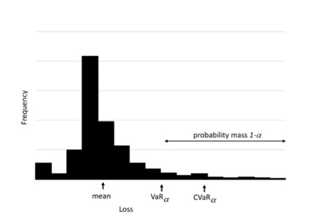

.. _sec-CVaR:

Risk-Based Stochastic Capital Budgeting using Conditional Value-at-Risk
=======================================================================

Value-at-Risk (VaR) is widely used in finance to indicate percentiles of loss
distributions. For instance, 95%-VaR is an upper estimate of losses that is
exceeded with 5% probability. VaR is popular because it is simple and easy to
interpret. However, VaR may have undesirable mathematical characteristics, such as
a lack of subadditivity and convexity :cite:`ThinkingCoherently,CoherentMeasureRisk`.

An alternative percentile-based risk measure is Conditional Value-at-Risk (CVaR),
which has more attractive properties, including subadditivity and convexity. CVaR,
also called mean excess loss, mean shortfall, or tail VaR, is defined as the
expected loss exceeding VaR. In general, CVaR is the weighted average of VaR and
the losses exceeding VaR. In this section, we focus on using CVaR for the capital
budgeting problem.

.. _definitionCVaR:

Definitions of VaR and CVaR
---------------------------

Let :math:`X` be a random variable with cumulative distribution function
:math:`F(z) = P\{X \le z\}`. It can be useful to think of :math:`X` as a *loss*
(or more generally, a variable for which large values are undesirable). The VaR
of :math:`X` with confidence level :math:`\alpha` (e.g., :math:`\alpha = 0.9`) is:

.. math::

   VaR_\alpha(X) = \min \{ z \mid F_X(z) \ge \alpha \}

If :math:`X` is continuous, this is equivalent to
:math:`VaR_\alpha(X) = F_X^{-1}(\alpha)`. By this definition,
:math:`VaR_\alpha(X)` is the (lower) :math:`\alpha`-percentile of the random
variable :math:`X`.

An alternative risk measure is CVaR, where :math:`CVaR_\alpha(X)` is the
conditional expectation of :math:`X` given that :math:`X \ge VaR_\alpha(X)`.
Figure :numref:`fig-CVaR` shows the relationship between these two measures of risk.

   Relationship between value-at-risk and conditional value-at-risk.

A typical definition of :math:`CVaR_\alpha(X)` is:

.. math::

   CVaR_\alpha(X) = E\{ X \mid X > VaR_\alpha(X) \}.

There are alternative, mathematically equivalent ways to define this measure.
Rockafellar and Uryasev :cite:`OptCVaR,RemarksCVaR` define CVaR as:

.. math::

   CVaR_\alpha(X) = \min_u \Bigl\{ u + \frac{1}{1-\alpha}
   E\bigl[(X-u)^+\bigr] \Bigr\},

where :math:`(X-u)^+ = \max(X-u, 0)`. Here, :math:`u` is an auxiliary decision
variable whose optimal value turns out to be :math:`VaR_\alpha(X)`. This
definition is particularly useful for computation in optimization models.

Researchers have argued for using CVaR over VaR as a measure of risk. Theoretically,
CVaR satisfies the assumptions of a coherent risk measure, whereas VaR does not.
Intuitively, minimizing VaR focuses only on the percentile value (e.g., the 95th
percentile) of the loss and ignores the magnitude of even larger losses, while
CVaR incorporates those tail magnitudes.

.. _CVaRCapitalBudgeting:

CVaR in Capital Budgeting
-------------------------

In this section, an explicit risk measure is constructed using a weighted
combination of expectation and CVaR. This approach allows us to parametrically
vary the weight on maximizing expected NPV versus penalizing solutions that yield
low-NPV scenarios. We denote the weight by :math:`\lambda`, with
:math:`0 \le \lambda \le 1`.

Let :math:`NPV(s,\xi)` denote the net present value under a prioritization decision
:math:`s`, and under a realization :math:`\xi` of the budget and profit for each
project. We seek to solve:

.. math::

   \max_{s \in S} \;
   (1-\lambda) E[NPV(s,\xi)]
   - \lambda \, CVaR_\alpha[-NPV(s,\xi)].

When :math:`\lambda = 0`, the model reduces to the stochastic optimization model
discussed in Section :ref:`sec-StochasticCapitalBudgeting`; that is, we seek a
prioritization :math:`s` to maximize expected NPV, with :math:`s \in S`
representing feasibility constraints.

The functional :math:`CVaR_\alpha[X]` is typically applied to a random variable
:math:`X` representing a *loss*; i.e., we seek to avoid large values of :math:`X`.
Let :math:`VaR_\alpha[X]` denote the :math:`\alpha`-quantile of :math:`X`. For
example, if :math:`\alpha = 0.75`, :math:`VaR_{0.75}[X]` is the value such that
75% of realizations of :math:`X` have lower losses. Suppose for simplicity that
:math:`NPV(s,\xi)` is positive. Large :math:`NPV(s,\xi)` is desirable, so large
values of :math:`-NPV(s,\xi)` (i.e., values closer to zero) correspond to worse
outcomes.

Using :math:`CVaR_\alpha[X] = E[X \mid X > VaR_\alpha[X]]`, the conditional
value-at-risk is the expected loss given that the loss exceeds a specified
percentile. Thus, when :math:`\lambda = 1`, the objective focuses on minimizing
the expected NPV conditional on being in the low tail (i.e., “bad outcomes”).
For :math:`0 < \lambda < 1`, we trade off expected reward and risk, captured by
expected NPV and CVaR, respectively.

The full mathematical optimization model of CVaR for the capital budgeting problem
is:

.. math::
   :label: fullCVaR

   \begin{aligned}
   \max_{x, y, \nu, u} \quad
   & (1-\lambda) \sum_{\omega \in \Omega} q^\omega
     \sum_{i \in I} \sum_{j \in J_i} a_{ij}^\omega x_{ij}^\omega
     - \lambda \Bigl[u + \frac{1}{1-\alpha}
       \sum_{\omega \in \Omega} q^\omega \nu^\omega \Bigr] \\
   \text{s.t.} \quad
   & \nu^\omega \ge
     - \sum_{i \in I} \sum_{j \in J_i} a_{ij}^\omega x_{ij}^\omega - u,
     && \omega \in \Omega, \\
   & y_{ii'} + y_{i'i} \ge 1,
     && i < i',\; i, i' \in I, \\
   & \sum_{j=1}^{J_i} x_{ij}^\omega
     \ge \sum_{j=1}^{J_i} x_{i'j}^\omega + y_{ii'} - 1,
     && i \neq i',\; i, i' \in I,\; \omega \in \Omega, \\
   & \sum_{i \in I} \sum_{j \in J_i} c_{ijkt}^\omega x_{ij}^\omega
     \le b_{kt}^\omega,
     && k \in K,\; t \in T,\; \omega \in \Omega, \\
   & \sum_{j \in J_i} x_{ij}^\omega \le 1,
     && i \in I,\; \omega \in \Omega, \\
   & y_{ii'},\, x_{ij}^\omega \in \{0,1\}, \\
   & \nu^\omega \ge 0,
     && \omega \in \Omega.
   \end{aligned}

.. _subsec-CVaRSettings:

LOGOS Settings for CVaR Problems
--------------------------------

The CVaR approach extends the stochastic optimization approach discussed in
Section :ref:`sec-StochasticCapitalBudgeting`. Both share the same input
structures except for the :xmlNode:`Settings` block.

In both cases, the user specifies a collection of scenarios via an
:xmlNode:`Uncertainties` block. The :xmlNode:`problem_type` within the
:xmlNode:`Settings` block selects the type of CVaR problem. The currently
available CVaR problem types are:

- :xmlString:`cvarskp`
- :xmlString:`cvarmkp`
- :xmlString:`cvarmckp`

The user can use :xmlNode:`risk_aversion` (i.e., :math:`\lambda`) and
:xmlNode:`confidence_level` (i.e., :math:`\alpha`) to control the CVaR problem.

Example LOGOS input XML for CVaR:

.. code-block:: xml

   <Settings>
   <Logos>
     <solver>cbc</solver>
     <solverOptions>
       <StochSolver>EF</StochSolver>
       <risk_aversion>0.1</risk_aversion>
       <confidence_level>0.95</confidence_level>
     </solverOptions>
     <sense>maximize</sense>
     <problem_type>cvarskp</problem_type>
   </Settings>
   </Logos>

.. _subsec-CVaR_SKP:

CVaR for Single Knapsack Problem
--------------------------------

*Model formulation.*

.. math::
   :label: CVaRSimpleKP

   \begin{aligned}
   \max_{x, y, \nu, u} \quad
   & (1-\lambda) \sum_{\omega \in \Omega} q^\omega
     \sum_{i \in I} a_i^\omega x_i^\omega
     - \lambda \Bigl[u + \frac{1}{1-\alpha}
       \sum_{\omega \in \Omega} q^\omega \nu^\omega\Bigr] \\
   \text{s.t.} \quad
   & \nu^\omega \ge
     - \sum_{i \in I} a_i^\omega x_i^\omega - u,
     && \omega \in \Omega, \\
   & \sum_{i \in I} c_i^\omega x_i^\omega
     \le b^\omega,
     && \omega \in \Omega, \\
   & y_{ii'} + y_{i'i} \ge 1,
     && i < i', \\
   & x_i^\omega \ge x_{i'}^\omega + y_{ii'} - 1,
     && i \ne i', \\
   & x_i^\omega, y_{ii'}^\omega \in \{0,1\}, \\
   & \nu^\omega \ge 0,\; \omega \in \Omega,\;
     \lambda \in [0,1].
   \end{aligned}

See Section :ref:`subsec-CVaR_DKP` for an example LOGOS input file. The
multi-dimensional Knapsack problem is a straightforward extension of the
single-dimensional case, and both belong to :xmlNode:`problem_type`
:xmlString:`cvarskp`.

.. _subsec-CVaR_DKP:

CVaR for Multi-Dimensional Knapsack Problem
-------------------------------------------

*Model formulation.*

.. math::
   :label: CVaRMultiDKP

   \begin{aligned}
   \max_{x, y, \nu, u} \quad
   & (1-\lambda) \sum_{\omega \in \Omega} q^\omega
     \sum_{i \in I} a_i^\omega x_i^\omega
     - \lambda \Bigl[u + \frac{1}{1-\alpha}
       \sum_{\omega \in \Omega} q^\omega \nu^\omega\Bigr] \\
   \text{s.t.} \quad
   & \nu^\omega \ge
     - \sum_{i \in I} a_i^\omega x_i^\omega - u,
     && \omega \in \Omega, \\
   & \sum_{i \in I} c_{it}^\omega x_i^\omega
     \le b_t^\omega,
     && t \in T, \\
   & y_{ii'} + y_{i'i} \ge 1,
     && i < i', \\
   & x_i^\omega \ge x_{i'}^\omega + y_{ii'} - 1,
     && i \ne i', \\
   & x_i^\omega, y_{ii'}^\omega \in \{0,1\}, \\
   & \nu^\omega \ge 0,\; \omega \in \Omega,\;
     \lambda \in [0,1].
   \end{aligned}

Example LOGOS input XML:

.. code-block:: xml

   <Logos>
     <Sets>
       <investments>
         1,2,3,4,5,6,7,8,9,10,11,12,13,14,15,16
       </investments>
       <time_periods>
         1,2,3,4,5
       </time_periods>
     </Sets>

     <Parameters>
       <net_present_values index="investments">
         2.315,0.824,22.459,60.589,0.667,5.173,4.003,0.582,0.122,
         -2.870,-0.102,-0.278,-0.322,-3.996,-0.246,-20.155
       </net_present_values>
       <costs index="investments, time_periods">
         0.219,0.257,0.085,0.0,0.0,
         0.0,0.0,0.122,0.103,0.013,
         5.044,1.839,0.0,0.0,0.0,
         6.74,6.134,10.442,0.0,0.0,
         0.425,0.0,0.0,0.0,0.0,
         2.125,2.122,0.0,0.0,0.0,
         2.387,0.19,0.012,2.383,0.192,
         0.0,0.95,0.0,0.0,0.0,
         0.03,0.03,0.688,0.0,0.0,
         0,0.2,0.763,0.739,2.539,
         0.081,0.032,0,0,0,
         0.3,0,0,0,0,
         0.347,0,0,0,0,
         4.025,0.297,0,0,0,
         0.095,0.095,0.095,0,0,
         5.487,5.664,0.5,6.803,6.778
       </costs>
       <available_capitals index="time_periods">
         18,18,18,18,18
       </available_capitals>
     </Parameters>

     <Uncertainties>
       <available_capitals>
         <totalScenarios>10</totalScenarios>
         <probabilities>
           0.012, 0.019, 0.032, 0.052, 0.086,
           0.142, 0.235, 0.188, 0.141, 0.093
         </probabilities>
         <scenarios>
           11, 11, 11, 11, 11,
           12, 12, 12, 12, 12,
           13, 13, 13, 13, 13,
           14, 14, 14, 14, 14,
           15, 15, 15, 15, 15,
           16, 16, 16, 16, 16,
           17, 17, 17, 17, 17,
           18, 18, 18, 18, 18,
           19, 19, 19, 19, 19,
           20, 20, 20, 20, 20
         </scenarios>
       </available_capitals>
     </Uncertainties>

     <Settings>
       <mandatory>10,11,12,13,14,15,16</mandatory>
       <solver>cbc</solver>
       <solverOptions>
         <StochSolver>EF</StochSolver>
         <!-- lambda for risk aversion -->
         <risk_aversion>0.1</risk_aversion>
         <!-- confidence level -->
         <confidence_level>0.95</confidence_level>
       </solverOptions>
       <sense>maximize</sense>
       <problem_type>cvarskp</problem_type>
     </Settings>
   </Logos>

.. _subsec-CVaR_MKP:

CVaR for Multiple Knapsack Problem
----------------------------------

*Model formulation.*

.. math::
   :label: CVaRMKP

   \begin{aligned}
   \max_{x, y, \nu, u} \quad
   & (1-\lambda) \sum_{\omega \in \Omega} q^\omega
     \sum_{m \in M} \sum_{i \in I} a_i^\omega x_{i,m}^\omega
     - \lambda \Bigl[u + \frac{1}{1-\alpha}
       \sum_{\omega \in \Omega} q^\omega \nu^\omega\Bigr] \\
   \text{s.t.} \quad
   & \nu^\omega \ge
     - \sum_{m \in M} \sum_{i \in I} a_i^\omega x_{i,m}^\omega - u,
     && \omega \in \Omega, \\
   & \sum_{i \in I} c_i^\omega x_{i,m}^\omega
     \le b_m^\omega,
     && m \in M,\; \omega \in \Omega, \\
   & y_{ii'} + y_{i'i} \ge 1,
     && i < i', \\
   & \sum_{m=1}^{M} x_{i,m}^\omega
     \ge \sum_{m=1}^{M} x_{i',m}^\omega + y_{ii'} - 1,
     && i \ne i', \\
   & \sum_{m=1}^{M} x_{i,m}^\omega \le 1, \\
   & x_{i,m}^\omega, y_{ii'}^\omega \in \{0,1\}, \\
   & \nu^\omega \ge 0,\; \omega \in \Omega,\;
     \lambda \in [0,1].
   \end{aligned}

Example LOGOS input XML:

.. code-block:: xml

   <Logos>
     <Sets>
       <investments>
         1,2,3,4,5,6,7,8,9,10
       </investments>
       <capitals>
         unit_1, unit_2
       </capitals>
     </Sets>

     <Parameters>
       <net_present_values index="investments">
         78, 35, 89, 36, 94, 75, 74, 79, 80, 16
       </net_present_values>
       <costs index="investments">
         18, 9, 23, 20, 59, 61, 70, 75, 76, 30
       </costs>
       <available_capitals index="capitals">
         103, 156
       </available_capitals>
     </Parameters>

     <Uncertainties>
       <available_capitals>
         <totalScenarios>10</totalScenarios>
         <probabilities>
           0.1 0.1 0.1 0.1 0.1 0.1 0.1 0.1 0.1 0.1
         </probabilities>
         <scenarios>
           101, 154,
           102, 155,
           103, 156,
           104, 157,
           105, 158,
           106, 159,
           107, 160,
           108, 161,
           109, 162,
           110, 163
         </scenarios>
       </available_capitals>
     </Uncertainties>

     <Settings>
       <solver>cbc</solver>
       <solverOptions>
         <StochSolver>EF</StochSolver>
         <risk_aversion>1.0</risk_aversion>
         <confidence_level>0.95</confidence_level>
       </solverOptions>
       <sense>maximize</sense>
       <problem_type>cvarmkp</problem_type>
     </Settings>
   </Logos>

.. _subsec-CVaR_MCKP:

CVaR for Multiple-Choice Knapsack Problem
-----------------------------------------

*Model formulation.*

.. math::
   :label: CVaRMCKP

   \begin{aligned}
   \max_{x, y, \nu, u} \quad
   & (1-\lambda) \sum_{\omega \in \Omega} q^\omega
     \sum_{i \in I} \sum_{j \in J_i} a_{ij}^\omega x_{ij}^\omega
     - \lambda \Bigl[u + \frac{1}{1-\alpha}
       \sum_{\omega \in \Omega} q^\omega \nu^\omega\Bigr] \\
   \text{s.t.} \quad
   & \nu^\omega \ge
     - \sum_{i \in I} \sum_{j \in J_i} a_{ij}^\omega x_{ij}^\omega - u,
     && \omega \in \Omega, \\
   & \sum_{i \in I} \sum_{j \in J_i} c_{ijkt}^\omega x_{ij}^\omega
     \le b_{kt}^\omega,
     && k \in K,\; t \in T,\; \omega \in \Omega, \\
   & y_{ii'} + y_{i'i} \ge 1,
     && i < i', \\
   & \sum_{j=1}^{J_i - 1} x_{ij}^\omega
     \ge \sum_{j=1}^{J_i - 1} x_{i'j}^\omega + y_{ii'} - 1,
     && i \ne i',\; i, i' \in I,\; \omega \in \Omega, \\
   & \sum_{j=1}^{J_i} x_{ij}^\omega = 1,
     && i \in I, \\
   & x_{ij}^\omega, y_{ii'}^\omega \in \{0,1\}, \\
   & \nu^\omega \ge 0,\; \omega \in \Omega,\;
     \lambda \in [0,1].
   \end{aligned}

Example LOGOS input XML:

.. code-block:: xml

   <Logos>
     <Sets>
       <investments>
         1, 2, 3, 4, 5, 6, 7, 8, 9, 10, 11, 12, 13, 14, 15, 16, 17
       </investments>
       <options index='investments'>
         1;
         1;
         1;
         1,2,3;
         1,2,3,4;
         1,2,3,4,5,6,7;
         1;
         1;
         1;
         1;
         1;
         1;
         1;
         1;
         1;
         1;
         1
       </options>
     </Sets>

     <Parameters>
       <net_present_values index='options'>
         2.046
         2.679
         2.489
         2.61
         2.313
         1.02
         3.013
         2.55
         3.351
         3.423
         3.781
         2.525
         2.169
         2.267
         2.747
         4.309
         6.452
         2.849
         7.945
         2.538
         1.761
         3.002
         3.449
         2.865
         3.999
         2.283
         0.9
         8.608
       </net_present_values>
       <costs index='options'>
         36538462
         83849038
         4615385
         2788461538
         2692307692
         5480769231
         1634615385
         2981730768
         7211538462
         9038461538
         649038462
         650000000
         216346154
         212500000
         3076923077
         3942307692
         1144230769
         675721154
         1442307692
         99711538
         4807692
         123076923
         138461538
         86538462
         108653846
         75092404
         6413462
         147932692
       </costs>
       <available_capitals>
         15E9
       </available_capitals>
     </Parameters>

     <Uncertainties>
       <available_capitals>
         <totalScenarios>3</totalScenarios>
         <probabilities>
           0.2,0.6,0.2
         </probabilities>
         <scenarios>
           5E9,10E9,15E9
         </scenarios>
       </available_capitals>
     </Uncertainties>

     <Settings>
       <solver>glpk</solver>
       <solverOptions>
         <StochSolver>EF</StochSolver>
         <risk_aversion>0.1</risk_aversion>
         <confidence_level>0.95</confidence_level>
       </solverOptions>
       <sense>maximize</sense>
       <problem_type>cvarmckp</problem_type>
     </Settings>
   </Logos>
